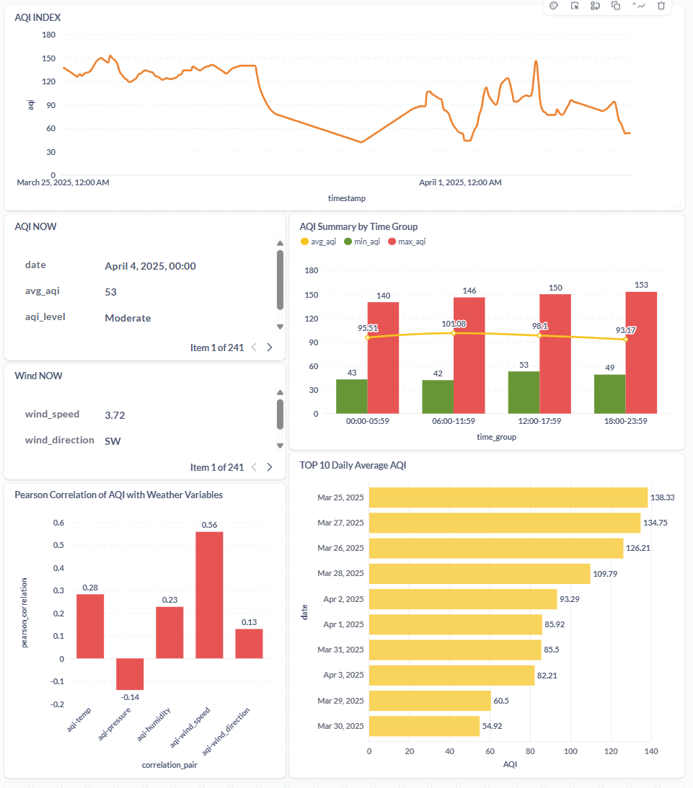

<h1 align="center"> AQI Capstone Project: Real-time Air Quality Data Pipeline </h1>

<p align="center">
  
  
  
    
  
</p>
<p align="center">
   สร้างระบบ Data Pipeline ดึงข้อมูลคุณภาพอากาศจาก Air Visual API ด้วย DAGS ที่รันด้วย Apache Airflow และมีการตรวจสอบความถูกต้องของข้อมูลก่อนจะนำข้อมูลที่ได้มาจัดเก็บไว้ในฐานข้อมูล PostgreSQL พร้อมทั้งนำข้อมูลดังกล่าวมานำเสนอโดย Dashboard แบบ Hourly Updated ด้วย Metabase สำหรับการติดตาม วิเคราะห์ หรือพยากรณ์คุณภาพอากาศในอนาคต!
</p>

## 📡**Airflow DAG**
สร้าง DAGS และทำการรัน DAGS ไว้บน Apache Airflow เพื่อทำการดึงข้อมูลจาก Air Visual ผ่านทาง API ทุกนาทีที่ 25 ของทุกชั่วโมง

## 🔍**Validation Data**
ในการตรวจสอบความถูกต้องของข้อมูลที่ได้รับจาก API ซึ่งได้กำหนด Range ไว้ดังต่อไปนี้
-  **AQI** : ค่าไม่ต่ำกว่า 0
-  **Temperature** : มีค่าอยู่ระหว่าง 0 ถึง 45 องศาเซลเซียส (°C)
-  **Pressure** : มีค่าอยู่ระหว่าง 980 ถึง 1050 (ความกดอากาศในระดับพื้นผิว)
-  **Wind Direction** : มีค่าอยู่ระหว่าง 0 - 360 องศา (มุม)
-  **Humidity(%)** : มีค่าอยู่ที่ 0 - 100 (เปอร์เซ็น)

ซึ่งหากข้อมูลที่ได้รับจาก API มีค่าที่อยู่นอกเหนือจาก Range ที่กำหนด DAGS จะทำได้แจ้งเตือน Error ที่ Airflow และ Mailhog ทันที

## 📮**load AQI data to PostgreSQL**
มีการแปลง Timestamp UTC ให้เป็นข้อมูลที่อยู่ในรูปแบบ LocalTime ของประเทศไทย จากนั้นดึงข้อมูลเข้า **Table name** : aqi ใน **schema** : capstone โดยข้อมูลที่ทำการดึงได้แก่
-  **timestamp** : วันและเวลาตามประเทศไทย
-  **aqi** : ค่าคุณภาพอากาศ
-  **temp** : อุณหภูมิ (°C)
-  **pressure** : ความกดอากาศ (hPa)
-  **humidity** : ความชื้น (%)
-  **wind_speed** : ความเร็วลม (m/s)
-  **wind_direction** : ทิศทางลม (องศา)

## ❓**Bussiness Questions**
- วันที่มีค่าคุณภาพอากาศสูงที่สุด 10 อันดับ❓ (top_10_avg_aqi_daily)
- แต่ละช่วงเวลามีค่าคุณภาพอากาศ(เฉลี่ย,สูงสุด,ต่ำสุด) เป็นอย่างไรบ้าง❓ (aqi_summary_by_time)
- ชั่วโมงที่ผ่านมาทิศทางกระลมพัดไปทิศไหน❓ (wind_direction)
- คุณภาพอากาศล่าสุดอยู่ที่เท่าไรและอยู่ในเกณฑ์ที่ส่งผลกระทบต่อสุขภาพอย่างไร❓ (level_of_aqi)
- จากข้อมูลที่เก็บ ค่าคุณภาพอากาศมีความสัมพันธ์กับตัวแปรอื่นๆ อย่างไรบ้าง❓ (aqi_correlation)

## 🔧**DBT**

**หากต้องการรัน DBT ต้องย้าย directory บน terminal ไปที่ folder : AQI ก่อน**
`$cd /AQI`

ได้ทำการ setup DBT และทำการดึงข้อมูลจาก **schema : public** แยกออกไปเป็น 2 ส่วน ได้แก่
-  **ข้อมูล Process** ไว้ที่ **schema : dbt_nongp** ใช้สำหรับ process data ก่อนนำขึ้น production
-  **ข้อมูล Production** ไว้ที่ **schema : Production** ใช้สำหรับนำไปทำ Dashboard หรืออื่นๆ

### 📲 Data Model
มีการสร้าง Data Model  จำนวน 5 ตัว ตาม Bussiness Questions ไว้ในที่ `/workspaces/DPU_Capstone/AQI/models`
- ซึ่งหากต้องการรัน Data Model ขึ้น Process ให้ใช้คำสั่ง `dbt run` เพื่อดึงข้อมูลเข้า **schema : dbt_nongp** 
- หากต้องการรัน Data Model ขึ้น Production ให้ใช้คำสั่ง `dbt run -t production` เพื่อดึงข้อมูลเข้า **schema : Production**

**Note:select_all.sql เมื่อทำการรันด้วย `dbt run -t production` จะขึ้น Error เนื่องจากตั้งใจไม่ให้ Statement นี้ขึ้น Production**
### 🔎Test Data Model
มีการสร้าง Test Model เพื่อ Test Data Model ทั้ง 5 ตัว ว่ารัน SQL statement แล้วข้อมูลถูกต้องหรือไม่ หากมีข้อมูลผิดปกติ DBT จะแจ้งเตือน
- หากต้องการรัน Test Model ในส่วน Process ให้ใช้คำสั่ง `dbt test` เพื่อตรวจสอบข้อมูลใน **schema : dbt_nongp** ว่าไม่มีข้อมูลที่ผิดปกติ
- หากต้องการรัน Test Model ในส่วน Production ให้ใช้คำสั่ง `dbt test -t production` เพื่อตรวจสอบข้อมูลใน **schema : Production** ว่าไม่มีข้อมูลที่ผิดปกติ
### 📑DBT DOCS
มีการสร้าง Documentation ของ DBT ขึ้นมาเรียบร้อยแล้วโดยใช้คำสั่ง `dbt docs generate`\
ซึ่งหากต้องการเปิดตั้ว Browser ของ DBT ให้ใช้คำสั่ง `dbt docs serve --port 9090`\
ในส่วนของ Description ของ Model ต่างๆ ได้แก้ไขใน `_model.yml` ใน Folder : Model ของ DBT เรียบร้อยแล้ว
## 📊**Metabase (Dashboard)**
ได้ทำการเพิ่ม Metabase เข้าไปใน Docker เพื่อใช้ในการสร้าง Dashboard หากต้องการเปิด browser ในการใช้งาน Metabase\
ให้ไปที่ port แล้วทำการเปิด URL ใน port : 3000 ซึ่งจากการทดลองใช้งาน Metabase สามารถใช้งานได้เหมือนกับ adminer\
ทั้งหมดและยังสามารถทำ dashboard ได้ด้วย และสามารถตั้งค่า Database Syncing ได้ว่าจะดึงข้อมูลเป็นรายวันหรือรายชั่วโมง\
หากดึงข้อมูลมาแล้วให้นำข้อมูลที่ได้มานั้นไปอัพเดทใน Dashboard เมื่อไรก็สามารถทำได้\

**ข้อจำกัดที่พบในขณะนี้คือ** ยังไม่สามารถ **interaction** กับกราฟได้ ทำได้เพียงแสดงผลเท่านั้น




### Code ที่เพิ่มเข้าไปใน Docker : compose.yml
```
metabase:
    image: metabase/metabase:latest
    ports:
      - "3000:3000"
    environment:
      MB_DB_TYPE: postgres # หรือประเภทฐานข้อมูลของคุณ
      MB_DB_HOST: db        # หรือ Host ของฐานข้อมูลของคุณ
      MB_DB_PORT: 5432      # หรือ Port ของฐานข้อมูลของคุณ
      MB_DB_NAME: capstone  # ชื่อ Database
      MB_DB_USER: postgres  # Username
      MB_DB_PASS: postgres  # Password
      MB_ADMIN_PASSWORD: metabase # Admin Password
      MB_EMAIL_FROM_ADDRESS: *******@gmail.com # E-mail ของผู้ใช้งาน
    depends_on:
      - db # ถ้า Metabase ต้องรอฐานข้อมูล
```

## 🐳 Docker Command
```bash
# รัน Docker
$ docker compose up
# หยุด Docker
$ docker compose down
```
## ⚙️ DBT Setup
```bash
# เปลี่ยน Directory ไปที่ Folder AQI
$ cd /AQI
# รัน Data Models ใน Schema "dbt_nongp"
$ dbt run
# รัน Data Models ใน Schema "Production"
$ dbt run -t production
# สร้าง Documentation ของ DBT
$ dbt docs generate
# เปิด DBT Documentation ใน Browser
$ dbt docs serve --port 9090
# รัน DBT Tests
$ dbt test
```
## ⚠️ issue GITHUB
```bash
# ไม่สามารถ commit การเปลี่ยนแปลงจาก CodeSpace ได้ เนื่องจาก CodeSpace ของคุณยังไม่ได้รับข้อมูลการเปลี่ยนแปลงล่าสุดจาก origin/main
$ git config pull.rebase false
$ git pull origin main
```

---

## Crafted By
NAME: Mr.Atthaporn panklai\
DPU_ID: 67130235\
Master of Engineering in Artificial Intelligence and Data Engineering (Graduate Student)\
([View Profile on GitHub](https://github.com/NongP39))